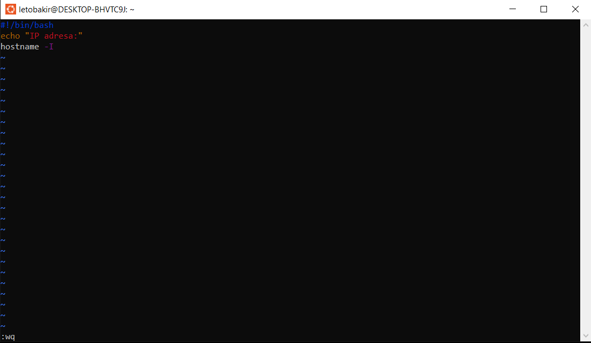
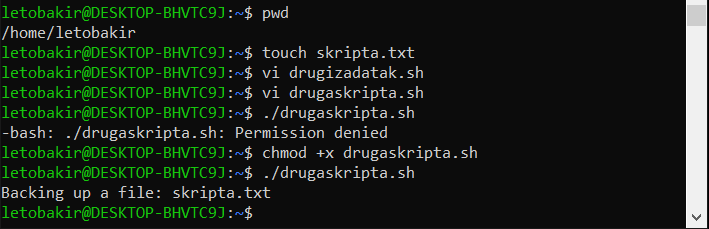
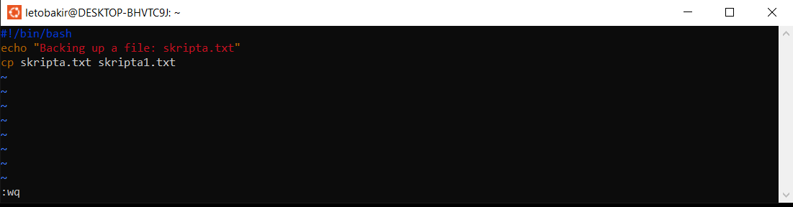
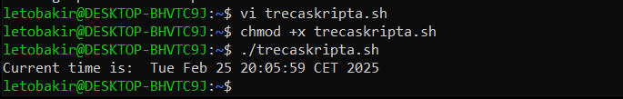
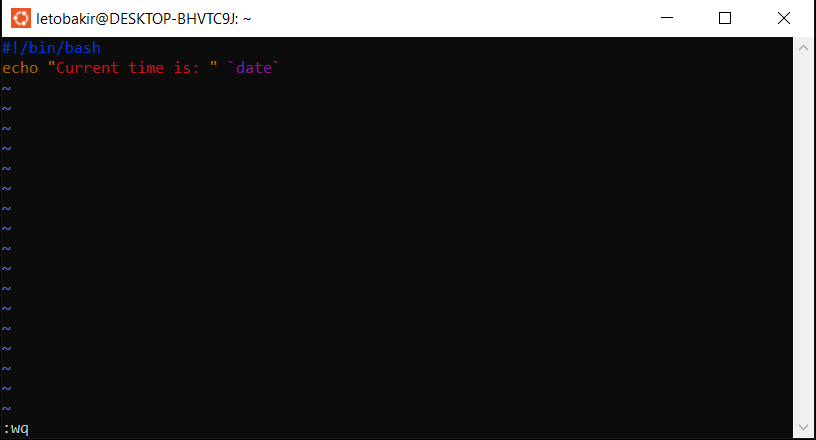
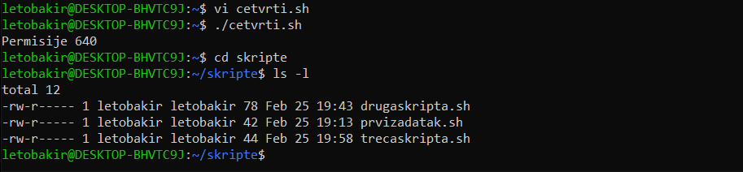
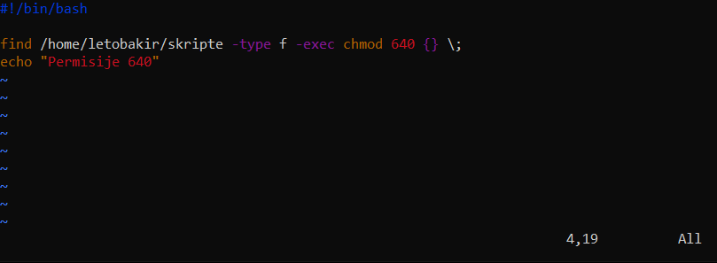
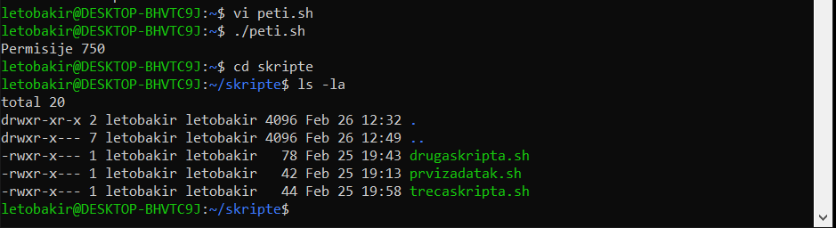
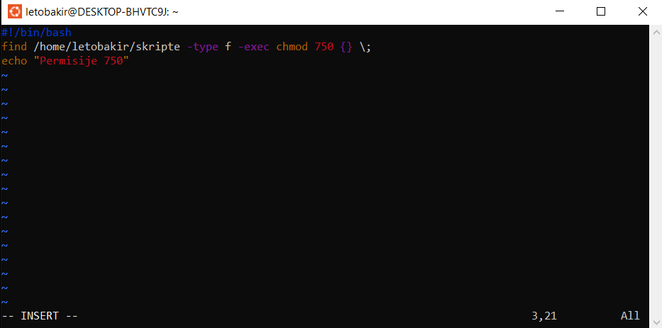

# Tasks

**1. Create a script which will print IP address of your Ubuntu system.**

To create a script we will use vi. By pressing I, you enter insert mode and can start writing the script.
To print IP address of our Ubuntu system use command `hostname -I`.
Once you are done with the script, save the it by clicking `esc` and typing `:qw`. 
After creating a script you sould try and running it with `./name of the script`.
If you receive "Permission denied", use `chmod +x name_of the_file` command to grant execution permission.
Now try running the script again.

**2. Create a file skripta.txt, and the script to backup a file skripta.txt as skripta-1.txt.**

Start by creating a file skripta.txt using `touch` command. 
Then create a script using vi. Use `cp` command to back up the existing skripta.txt file as skripta-1.txt. Save the script, then use the `chmod +x name_of_the_file` command to grant execution permissions to the script. Once you are done, run the script using `./name_of_the_file`.

**3. Create a script that shows the current time, with the message: 'Current time is:' current time.**

Create a script using vi. To display the current time, use the `date` command. Save the script, grant execution permissions with `chmod +x name_of_the_file`, and then run the script using `./name_of_the_file`.

**4. Create a script that automatically assigns 6-4-0 permissions to all scripts within a directory.**

To create a script that automatically assigns 6-4-0 permissions, we will use `find /path/to/the/directory -type f -exec chmod 640 {} \;`. We use command `find` to search for files/directories within directory, so you have to specifiy which directory by typing path to that directory. Next you specify which type you are looking for. In this case, we want to find files, so we use the `-type f` (`-type d` for directories). `-exec` because you want to execute something on files that are found. We are executing `chmod` 640 to assign 640 permissions to the files. The `{}` represents each file found, and the `\;` indicates the end of the command for each file. Try running a script using `./name_of_the_file` and see if the permissions are given to files within wanted directory. You can enter directory using command `cd` and using command `ls -l` you can see files in directory and their permissions on the their left. 
In this case we wanted to give files permissions 6-4-0 and that looks like this `-rw-r-----`.

`-` - means it is file

`rw` - User has read (4) and write (2) permissions (6)

`w--` - The group write has permission to write (2)

`---` - Others have no permissions (0)

**5. Create a script that automatically assigns 7-5-0 permissions to all scripts within a directory.**

To create a script that automatically assigns 7-5-0 permissions to all scripts within a directory, we are going to create script similar to one above. You use same command `find /path/to/the/directory -type f -exec chmod 750 {} \;`, just insted 6-5-0, we need 7-5-0 pemissions. Run a script and check if permissions are applied correctly by entering directory and using command `ls -l` to see files and permissions. In this case it looks like this `-rwxr-x---`.

`-` - means it is file

`rwx` - user has read (4), write(2) and execute (1) permissions (7)

`r-x` - group has read (4) and execute (1) permissions (5)

`---` - others have no permissions (0)

**6. Create a cron job that will automatically run sudo apt update and sudo apt upgrade every day at 02:00 AM.**

