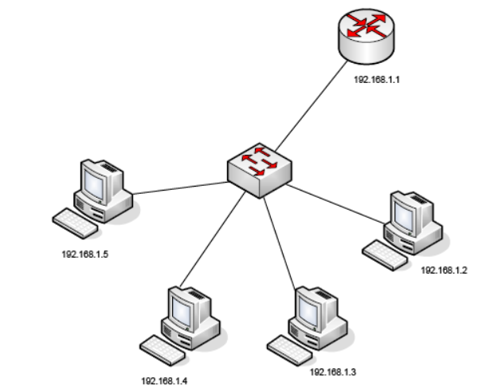
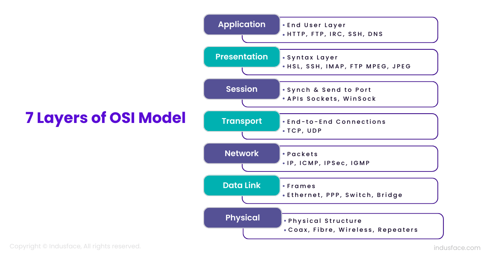

# Introduction

An **IP address** is used to identify a device on a network. It consists of 32 bits, divided into four groups of eight (octets).

Each IP address has two parts:
the `network part` (which identifies the network) and
the `host part` (which identifies the device within that network).

To separate the network part from the host part, a `subnet mask` is used. The subnet mask is a 32-bit address that determines which portion of the IP address refers to the network and which part refers to the host. For example, a common subnet mask for a home network is 255.255.255.0, which means the first three octets define the network and the last one defines the host.

In every network, two special addresses cannot be assigned to any device:

- The **network address**, which is the first address in the range (usually zero).
  
- The **broadcast address**, used to send messages to all devices in the network.

There are two types of IP addresses: private and public.

**Private IP** Private IP addresses are used within local networks, such as those in homes or offices, and are not accessible from the internet. These addresses allow devices within the same network to communicate without needing a unique internet address. When devices within a private network need to access the internet, `Network Address Translation (NAT)` is used to convert private IP addresses into a single public IP address.

**Public IP** addresses are assigned by Internet Service Providers (ISPs) and are used to identify devices on the internet. These addresses enable communication between devices across the global network. A **router** connects devices within a local network (which use private IP addresses) to the internet.

IP addresses can have values ranging from 0.0.0.0 to 255.255.255.255. To make it easier to manage these addresses, all IP addresses are divided into specific address classes.

The address ranges used for private IP addresses are:

**A class** 10.0.0.0 to 10.255.255.255 (10.0.0.0 /8)

**B class** 172.16.0 to 172.31.255.255 (172.16.0.0 /12)

**C class** 192.168.0.0 to 192.168.255.255 (192.168.0.0 /16)

An IP address can be set by the administrator (**static configuration**) or assigned through a DHCP server (**dynamic configuration**).

For two computers to communicate, they must be in the same network. If they are in different networks, a gateway is needed to find the destination network and deliver the data to the right computer. So **gateway** acts as the exit point from one network to another, directing traffic between networks.

To understand how communication flows in networks, we rely on layered models like the OSI model. This model consists of seven layers, each with a specific task in the data transmission process.

## OSI model

**Application Layer**: The top layer that interacts directly with end-user applications. It provides services like email, file transfer, and web browsing, using protocols such as `HTTP`, `FTP`, and `SMTP`.

- `HTTP` - (Hypertext Transfer Protocol) - is a protocol used for accessing web pages (port 80)

- `HTTPS` - the secure version of HTTP (port 443).

- `FTP (File Transfer Protocol)` - is a protocol used to transfer files between a client and a server over a network (port 21).

- `SMTP (Simple Mail Transfer Protocol)` - is a protocol used for sending and relaying email messages between mail servers (port 25).
  
- `SSH (Secure Shell)` - is a protocol used to securely access and manage remote computers over a network. Provides a secure channel to send data between a client and a server (port 22).

- `Telnet` - not secure version of `SSH` (port 23).

**Presentation Layer**: Translates data between the application layer and lower layers. It handles data encoding, encryption, and compression.

**Session Layer**: Responsible for managing the communication sessions between two devices or applications. It ensures that data is properly synchronized and organized

**Transport Layer**: Responsible for establishing end-to-end connections and ensuring reliable data transfer between hosts. It uses two main protocols:

- `TCP` - establishes a connection between the sender and receiver, ensuring that data is delivered without errors and in the correct order. This makes it a reliable protocol.

- `UDP` - does not establish a connection before sending data, which makes it faster but less reliable. UDP is typically used in applications where speed is more important than reliability, such as video streaming or online gaming.

**Network Layer**: Transfers packets (datagrams) from one computer to another. It uses the IP protocol to deliver packets to the transport layer on the destination computer.

**Data Link Layer**: Transfers packets from one device to the next, relying on the services of the physical layer.

**Physical Layer**: Deals with the transmission of raw data bits over a physical medium, such as cables or wireless signals.

## DNS (Domain Name System)

Computers communicate using IP addresses, but we usually use domain names to visit websites. For example, instead of typing an IP address, we type a website's domain name because it’s easier to remember.

However, computers still communicate through IP addresses. This what we need **DNS (Domain Name System)** for. DNS translates domain names, which are easier for people to understand, into IP addresses that computers can use. The user types a domain name into their web browser. For the computer, this is a request to communicate with the web server. The computer needs the IP address of the web server, but it doesn't have it. Therefore, it sends a request to the DNS server to get the required IP address. The DNS server finds IP address that is associated with domain name and sends this information back to the computer.

The computer then sends a request to the web server for that IP address. Once the web server receives the request, it sends back images, text, animations, etc., which are displayed by the web browser on the computer as a webpage.

## Commands

`ping` - Checks if a specific IP address or domain is reachable by sending a small data packet and measuring the response time.

`ipconfig` -  used to display the IP address, subnet mask, and default gateway of the computer's network interfaces.

`ipconfig/all` - used to display detailed information about all network interfaces on the computer, including the IP address, subnet mask, default gateway, DNS servers, MAC address, and other network configuration settings.

`netstat` - used to display active network connections on a computer, including information about remote locations (IP addresses and ports) and the status of these connections

`ipconfig/release` - used to release the current IP address assigned to your computer by the DHCP (Dynamic Host Configuration Protocol) server, essentially disconnecting your device from the network temporarily until a new IP address is requested.

`ipconfig/renew` - used to request a new IP address from the DHCP server, re-establishing the network connection after the IP address has been released (using `ipconfig /release`).

`tracert` -  used to display each subsequent hop, the next node/gateway through which the data successfully passes on its way to the destination."
